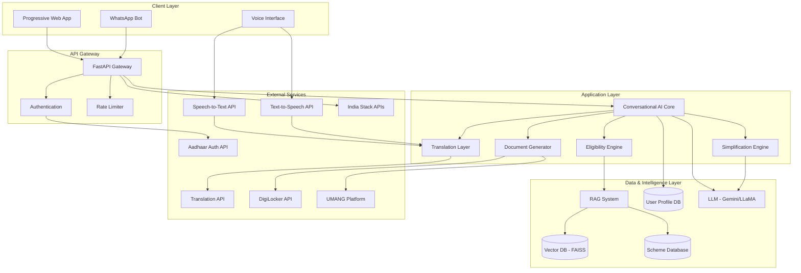

# Jansetu-Sahayak-AI

## Overview

JanSetu Sahayak AI is a voice-first, multilingual civic access platform designed to democratize access to government schemes for Indian citizens. This project aims to bridge the digital and linguistic divide by enabling citizens to discover, understand, and apply for welfare schemes through intuitive voice interactions, even on low-bandwidth devices. By converting complex bureaucratic language into simple, understandable information and providing personalized eligibility matching, the system empowers millions of digitally underserved citizens to access their rightful benefits.

## Core Features

*   **Multilingual Voice Interaction:** Interact with the system using your voice in multiple Indian languages, including Hindi, Tamil, Telugu, Bengali, and Marathi.
*   **Smart Eligibility Matching:** Receive personalized recommendations for government schemes based on your profile (age, income, state, etc.), ensuring you only see what you're eligible for.
*   **Language Simplification:** Complex government terminology is automatically converted into simple, citizen-friendly language with culturally relevant examples.
*   **Personalized Document Checklists:** Get a clear, customized list of mandatory and optional documents required for any scheme application, along with information on where to obtain them.
*   **Low-Bandwidth Optimization:** Designed to work seamlessly on slow or intermittent internet connections (2G/3G) through a Progressive Web App (PWA) and a WhatsApp bot interface.
*   **Secure Profile Management:** Your information is stored securely, allowing you to return to the system without re-entering details every time.
*   **Government Platform Integration:** Connects with India's digital ecosystem, including DigiLocker for document retrieval and UMANG for service applications.

## System Architecture

The system is built on a modular, microservices-based architecture to ensure scalability and maintainability.

### High-Level Architecture Diagram


### Component Interaction Flow

1.  A citizen speaks a query in their local language, which is captured by the **Voice Interface**.
2.  The audio is converted to text by an **STT** service and translated to English by the **Translation Layer**.
3.  The **Conversational AI Core** receives the query, retrieves the user's profile and conversation context.
4.  The **RAG System** performs a semantic search to find relevant government schemes from the **Vector DB**.
5.  The **Eligibility Engine** filters these schemes based on the user's profile.
6.  The **LLM** generates a clear, simple response, which is then translated back to the citizen's language.
7.  An **TTS** service converts the text response to audio, which is played back to the citizen.

## Technology Stack

*   **Frontend**: Progressive Web App (PWA) using React Lite/Preact, Web Speech API, Tailwind CSS.
*   **Backend**: FastAPI (Python) for asynchronous API, WebSockets for voice streaming.
*   **AI/ML**:
    *   **LLM**: Google Gemini API or a self-hosted LLaMA model.
    *   **Vector Database**: FAISS for local deployment, or a cloud-based solution like Pinecone.
    *   **Embeddings**: `multilingual-e5-large` or `IndicBERT`.
    *   **STT/TTS**: Google Cloud Speech-to-Text/Text-to-Speech or Azure Speech services.
    *   **Translation**: Google Cloud Translation API or open-source `IndicTrans2`.
*   **Data Storage**: PostgreSQL for user and scheme data, Redis for caching and session management.
*   **Infrastructure**: Docker for containerization, CDN for static assets.

## Data Models

Key data structures used throughout the system.

### User Profile
```python
@dataclass
class UserProfile:
    user_id: str
    phone_number: str
    preferred_language: LanguageCode
    
    # Demographics
    name: Optional[str]
    age: Optional[int]
    gender: Optional[str]
    
    # Location
    state: str
    district: Optional[str]
    is_rural: bool
    
    # Economic
    annual_income: Optional[float]
    occupation: Optional[str]
    
    # Social
    caste_category: Optional[str]
    minority_status: bool
    
    # Special categories
    is_bpl: bool
    is_disabled: bool
    is_farmer: bool
```

### Government Scheme
```python
@dataclass
class Scheme:
    scheme_id: str
    name: str
    name_translations: Dict[LanguageCode, str]
    description: str
    category: str
    scheme_type: str  # "central", "state"
    eligibility_criteria: EligibilityCriteria
    benefit_description: str
    required_documents: List[str]
    application_process: str
    applicable_states: List[str]
    last_updated: date
```

## Project Documentation

For a deeper dive into the system's design and requirements, please refer to the following documents:

*   **[Requirements Document](./requirements.md)**: Detailed user stories, functional requirements, and acceptance criteria.
*   **[Design Document](./design.md)**: In-depth technical architecture, component interfaces, data models, and testing strategies.

## License

This project is licensed under the MIT License. See the [LICENSE](./LICENSE) file for more details.
