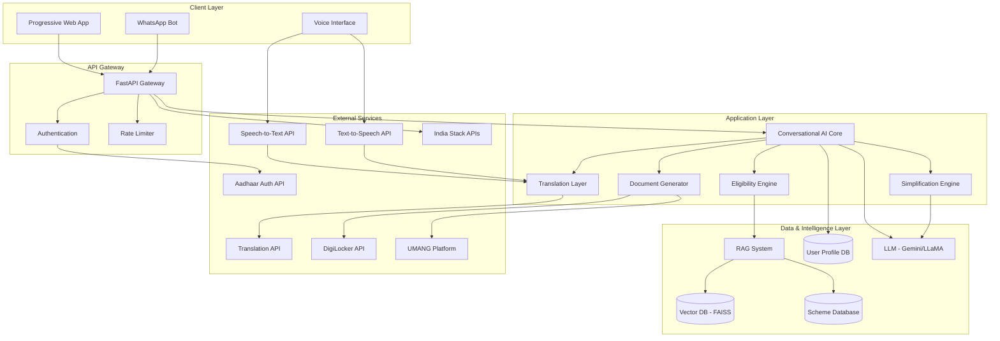

# Design Document: JanSetu Sahayak AI

## Overview

JanSetu Sahayak AI is a voice-first, multilingual civic access platform that democratizes access to government schemes for Indian citizens. The system architecture is designed around three core principles: voice-first interaction, low-bandwidth optimization, and intelligent personalization.

The system employs a modular architecture with six primary components:

1. **Voice Interface Layer**: Handles speech-to-text (STT) and text-to-speech (TTS) in multiple Indian languages
2. **Translation & Language Processing Layer**: Manages multilingual translation and language detection
3. **Conversational AI Core**: Orchestrates dialogue management, context tracking, and response generation using an LLM
4. **Eligibility Engine**: Implements rule-based and AI-powered scheme matching
5. **RAG System**: Retrieves relevant government scheme information using vector search
6. **Data Layer**: Manages user profiles, scheme database, and conversation state

The design prioritizes accessibility, working seamlessly on low-bandwidth connections and basic devices while supporting both voice and text modalities.

## Architecture

### High-Level Architecture



### Component Interaction Flow

**Typical User Query Flow:**

1. Citizen speaks query in local language → Voice Interface captures audio
2. Audio sent to STT service → Converts to text in local language
3. Translation Layer detects language → Translates to English for LLM
4. Conversational AI Core receives query → Retrieves user profile and conversation context
5. RAG System performs semantic search → Retrieves relevant schemes from Vector DB
6. Eligibility Engine filters schemes → Matches against user profile
7. LLM generates response → Simplification Engine ensures clarity
8. Translation Layer converts response → Back to citizen's language
9. TTS service generates audio → Voice Interface plays response

### Technology Stack

**Frontend:**
- Progressive Web App (PWA) using React Lite or Preact
- Web Speech API for browser-based voice input
- Service Workers for offline capability
- Tailwind CSS for responsive, accessible UI

**Backend:**
- FastAPI (Python) for high-performance async API
- WebSocket support for real-time voice streaming
- Redis for session management and caching

**AI/ML Components:**
- LLM: Google Gemini API or self-hosted LLaMA 2/3
- Vector Database: FAISS for local deployment or Pinecone for cloud
- Embeddings: multilingual-e5-large or IndicBERT for Indian languages
- STT: Google Cloud Speech-to-Text or Azure Speech (supports Indian languages)
- TTS: Google Cloud Text-to-Speech or Azure Speech
- Translation: Google Cloud Translation API or IndicTrans2 (open-source)

**Data Storage:**
- PostgreSQL for user profiles and structured scheme data
- Redis for caching and session state
- S3-compatible storage for audio files (if needed)

**Infrastructure:**
- Docker containers for microservices
- Kubernetes for orchestration (optional for scale)
- CDN for static assets
- Load balancer for API gateway

## Components and Interfaces

### 1. Voice Interface Layer

**Responsibilities:**
- Capture audio input from user's device
- Stream audio to STT service
- Receive text responses and convert to speech via TTS
- Handle audio playback and user controls (pause, replay)
- Provide visual feedback during processing

**Key Interfaces:**

```python
class VoiceInterface:
    def start_recording() -> AudioStream:
        """Initiates audio capture from device microphone"""
        
    def stop_recording() -> AudioData:
        """Stops recording and returns captured audio"""
        
    def send_to_stt(audio: AudioData, language_hint: str) -> str:
        """Sends audio to STT service with language hint"""
        
    def text_to_speech(text: str, language: str, voice_gender: str) -> AudioData:
        """Converts text to speech in specified language"""
        
    def play_audio(audio: AudioData) -> None:
        """Plays audio response to user"""
```

**Implementation Notes:**
- Use Web Speech API for browser-based clients
- Implement audio compression (Opus codec) for low-bandwidth scenarios
- Support both streaming and batch STT modes
- Cache common TTS responses to reduce API calls

### 2. Translation Layer

**Responsibilities:**
- Detect input language automatically
- Translate between Indian languages and English
- Preserve domain-specific terminology
- Handle code-mixing (Hinglish, Tanglish, etc.)
- Maintain translation quality metrics

**Key Interfaces:**

```python
class TranslationLayer:
    def detect_language(text: str) -> LanguageCode:
        """Detects the language of input text"""
        
    def translate_to_english(text: str, source_lang: LanguageCode) -> TranslationResult:
        """Translates from Indian language to English for LLM processing"""
        
    def translate_from_english(text: str, target_lang: LanguageCode) -> TranslationResult:
        """Translates LLM response from English to citizen's language"""
        
    def preserve_entities(text: str, entities: List[Entity]) -> str:
        """Ensures scheme names, numbers, dates remain unchanged"""
        
    def handle_code_mixing(text: str) -> NormalizedText:
        """Processes mixed-language input (e.g., Hindi + English)"""

class TranslationResult:
    translated_text: str
    confidence_score: float
    detected_language: LanguageCode
    preserved_entities: List[Entity]
```

**Implementation Notes:**
- Use IndicTrans2 for Indian language pairs (open-source, optimized for Indic languages)
- Fallback to Google Cloud Translation API for higher accuracy when needed
- Implement entity recognition to preserve scheme names, monetary values, dates
- Cache translations for common phrases to reduce latency

### 3. Conversational AI Core

**Responsibilities:**
- Orchestrate conversation flow
- Maintain dialogue context and state
- Route queries to appropriate components
- Generate natural language responses
- Handle multi-turn conversations
- Manage user profile collection

**Key Interfaces:**

```python
class ConversationalAICore:
    def process_query(
        user_id: str,
        query: str,
        language: LanguageCode,
        context: ConversationContext
    ) -> Response:
        """Main entry point for processing user queries"""
        
    def collect_profile_info(
        user_id: str,
        conversation_history: List[Message]
    ) -> UserProfile:
        """Guides user through profile creation via conversation"""
        
    def maintain_context(
        session_id: str,
        new_message: Message
    ) -> ConversationContext:
        """Updates and maintains conversation context"""
        
    def generate_response(
        query: str,
        retrieved_schemes: List[Scheme],
        user_profile: UserProfile,
        context: ConversationContext
    ) -> str:
        """Generates natural language response using LLM"""
        
    def resolve_references(
        query: str,
        context: ConversationContext
    ) -> ResolvedQuery:
        """Resolves pronouns and references like 'that scheme', 'the loan'"""

class ConversationContext:
    session_id: str
    user_id: str
    language: LanguageCode
    conversation_history: List[Message]
    mentioned_schemes: List[str]
    current_topic: str
    last_updated: datetime
    
class Response:
    text: str
    schemes: List[Scheme]
    action: Optional[Action]  # e.g., "show_documents", "save_profile"
    confidence: float
```

**Implementation Notes:**
- Use LLM (Gemini or LLaMA) with system prompts optimized for Indian civic context
- Implement conversation state machine for profile collection
- Store context in Redis with 15-minute TTL
- Use prompt engineering to ensure culturally appropriate responses

### 4. Eligibility Engine

**Responsibilities:**
- Evaluate user eligibility for government schemes
- Apply rule-based filters (hard constraints)
- Use AI reasoning for soft constraints
- Rank schemes by relevance
- Explain eligibility decisions

**Key Interfaces:**

```python
class EligibilityEngine:
    def evaluate_eligibility(
        user_profile: UserProfile,
        schemes: List[Scheme]
    ) -> List[EligibilityResult]:
        """Evaluates user against all schemes and returns matches"""
        
    def apply_hard_rules(
        user_profile: UserProfile,
        scheme: Scheme
    ) -> bool:
        """Checks mandatory eligibility criteria (age, income, category)"""
        
    def apply_soft_rules(
        user_profile: UserProfile,
        scheme: Scheme
    ) -> float:
        """Uses AI to score relevance for non-mandatory criteria"""
        
    def rank_schemes(
        eligible_schemes: List[EligibilityResult]
    ) -> List[EligibilityResult]:
        """Ranks schemes by relevance and benefit amount"""
        
    def explain_eligibility(
        user_profile: UserProfile,
        scheme: Scheme,
        result: EligibilityResult
    ) -> str:
        """Generates human-readable explanation of eligibility decision"""

class EligibilityResult:
    scheme: Scheme
    is_eligible: bool
    confidence: float
    matching_criteria: List[str]
    missing_criteria: List[str]
    relevance_score: float
    explanation: str
```

**Rule Engine Implementation:**

```python
class RuleEngine:
    """Hard-coded rules for common eligibility patterns"""
    
    def check_age_criteria(age: int, min_age: int, max_age: int) -> bool:
        return min_age <= age <= max_age
    
    def check_income_criteria(
        annual_income: float,
        income_limit: float,
        comparison: str  # "below", "above", "between"
    ) -> bool:
        if comparison == "below":
            return annual_income < income_limit
        elif comparison == "above":
            return annual_income > income_limit
        # ... more logic
    
    def check_category_criteria(
        user_category: str,
        eligible_categories: List[str]
    ) -> bool:
        return user_category in eligible_categories
    
    def check_state_criteria(
        user_state: str,
        scheme_states: List[str]
    ) -> bool:
        return "all" in scheme_states or user_state in scheme_states
```

**Implementation Notes:**
- Implement rule engine using Python dataclasses and pattern matching
- Use LLM for ambiguous cases (e.g., "preference given to women entrepreneurs")
- Cache eligibility results per user profile hash
- Log all eligibility decisions for audit trail

### 5. RAG System

**Responsibilities:**
- Index government scheme documents
- Perform semantic search over scheme database
- Retrieve relevant schemes based on query
- Maintain vector embeddings
- Handle scheme database updates

**Key Interfaces:**

```python
class RAGSystem:
    def index_schemes(schemes: List[Scheme]) -> None:
        """Creates vector embeddings and indexes schemes"""
        
    def semantic_search(
        query: str,
        user_profile: UserProfile,
        top_k: int = 5
    ) -> List[Scheme]:
        """Retrieves most relevant schemes using vector similarity"""
        
    def hybrid_search(
        query: str,
        filters: Dict[str, Any],
        top_k: int = 5
    ) -> List[Scheme]:
        """Combines semantic search with metadata filters"""
        
    def update_scheme(scheme: Scheme) -> None:
        """Updates existing scheme in vector database"""
        
    def get_scheme_by_id(scheme_id: str) -> Scheme:
        """Retrieves full scheme details by ID"""

class VectorStore:
    def add_embeddings(
        texts: List[str],
        embeddings: List[Vector],
        metadata: List[Dict]
    ) -> List[str]:
        """Adds embeddings to vector database"""
        
    def similarity_search(
        query_embedding: Vector,
        top_k: int,
        filters: Optional[Dict]
    ) -> List[SearchResult]:
        """Performs vector similarity search"""
```

**Embedding Strategy:**

- Use multilingual-e5-large model for embeddings (supports 100+ languages including Indian languages)
- Create embeddings for:
  - Scheme name and description
  - Eligibility criteria
  - Benefits and features
  - Target beneficiaries
- Store metadata: scheme_id, category, state, central/state, last_updated
- Implement hybrid search: vector similarity + metadata filters

**Implementation Notes:**
- Use FAISS for local deployment (free, fast)
- Implement incremental indexing for scheme updates
- Cache frequent queries
- Pre-filter by state/category before vector search to reduce search space

### 6. Simplification Engine

**Responsibilities:**
- Convert complex government language to simple terms
- Adapt explanation complexity to user literacy level
- Use culturally relevant examples
- Preserve accuracy while simplifying

**Key Interfaces:**

```python
class SimplificationEngine:
    def simplify_text(
        text: str,
        target_language: LanguageCode,
        literacy_level: str = "basic"
    ) -> str:
        """Simplifies complex text using LLM"""
        
    def convert_terminology(
        text: str,
        term_mappings: Dict[str, str]
    ) -> str:
        """Replaces bureaucratic terms with simple equivalents"""
        
    def add_examples(
        concept: str,
        target_language: LanguageCode
    ) -> str:
        """Adds culturally relevant examples to explain concepts"""
        
    def format_currency(amount: float, language: LanguageCode) -> str:
        """Formats currency in Indian notation (₹1,00,000)"""

# Predefined term mappings
TERM_MAPPINGS = {
    "economically weaker sections": "families earning less than ₹3 lakh per year",
    "Below Poverty Line": "BPL card holders",
    "per capita income": "income per family member",
    "subsidy": "government financial help",
    "beneficiary": "person who gets the benefit",
    # ... more mappings
}
```

**LLM Prompt Template for Simplification:**

```
You are helping Indian citizens understand government schemes. 
Simplify the following text while keeping it accurate:

Original: {complex_text}
Target audience: {literacy_level} literacy, {language} speaker
Requirements:
- Use simple, everyday words
- Explain amounts in Indian Rupees (₹)
- Use examples familiar to Indian citizens
- Keep sentences short
- Preserve all numbers, dates, and eligibility criteria exactly

Simplified version:
```

**Implementation Notes:**
- Use LLM with few-shot examples of good simplifications
- Maintain glossary of common term mappings
- Validate that simplification doesn't change eligibility criteria
- A/B test simplifications with real users

### 7. Document Generator

**Responsibilities:**
- Generate personalized document checklists
- Provide document descriptions and sources
- List application channels and timelines
- Customize based on user profile

**Key Interfaces:**

```python
class DocumentGenerator:
    def generate_checklist(
        scheme: Scheme,
        user_profile: UserProfile,
        language: LanguageCode
    ) -> DocumentChecklist:
        """Creates personalized document checklist for scheme application"""
        
    def get_document_info(
        document_name: str,
        language: LanguageCode
    ) -> DocumentInfo:
        """Provides details about a specific document"""
        
    def get_application_channels(
        scheme: Scheme,
        user_state: str
    ) -> List[ApplicationChannel]:
        """Lists all ways to apply (online/offline)"""

class DocumentChecklist:
    scheme_name: str
    mandatory_documents: List[Document]
    optional_documents: List[Document]
    application_channels: List[ApplicationChannel]
    timeline: ApplicationTimeline
    
class Document:
    name: str
    description: str
    where_to_obtain: str
    is_mandatory: bool
    category_specific: bool  # varies by SC/ST/OBC/General
    
class ApplicationChannel:
    type: str  # "online", "offline", "mobile_app"
    url: Optional[str]
    office_address: Optional[str]
    helpline: Optional[str]
    
class ApplicationTimeline:
    opens_on: Optional[date]
    closes_on: Optional[date]
    processing_time: str  # "2-4 weeks"
    is_always_open: bool
```

**Document Database Structure:**

```python
# Common documents with variations
COMMON_DOCUMENTS = {
    "aadhar_card": {
        "name": {"en": "Aadhar Card", "hi": "आधार कार्ड"},
        "description": {"en": "12-digit unique identity number", "hi": "12 अंकों का विशिष्ट पहचान नंबर"},
        "where": {"en": "UIDAI website or Aadhar center", "hi": "UIDAI वेबसाइट या आधार केंद्र"}
    },
    "income_certificate": {
        "name": {"en": "Income Certificate", "hi": "आय प्रमाण पत्र"},
        "description": {"en": "Proof of annual family income", "hi": "वार्षिक पारिवारिक आय का प्रमाण"},
        "where": {"en": "Tehsil office or online portal", "hi": "तहसील कार्यालय या ऑनलाइन पोर्टल"}
    },
    # ... more documents
}
```

**Implementation Notes:**
- Store document requirements in scheme database
- Use templates for common document combinations
- Provide state-specific variations
- Include visual examples of documents when possible (low-bandwidth permitting)
- Integrate with DigiLocker API for automatic document retrieval

### 8. Government Platform Integration Layer

**Responsibilities:**
- Integrate with DigiLocker for document access
- Integrate with UMANG for service delivery
- Support Aadhaar authentication (optional)
- Connect with India Stack APIs
- Handle OAuth/consent flows for data access

**Key Interfaces:**

```python
class GovernmentPlatformIntegration:
    def connect_digilocker(
        user_id: str,
        consent_token: str
    ) -> DigiLockerConnection:
        """Establishes connection to user's DigiLocker account"""
        
    def fetch_documents_from_digilocker(
        connection: DigiLockerConnection,
        document_types: List[str]
    ) -> List[Document]:
        """Retrieves specified documents from DigiLocker"""
        
    def generate_umang_deeplink(
        scheme: Scheme,
        user_profile: UserProfile
    ) -> str:
        """Creates deep link to UMANG app for scheme application"""
        
    def verify_aadhaar(
        aadhaar_number: str,
        otp: str
    ) -> AadhaarVerificationResult:
        """Verifies user identity using Aadhaar OTP"""
        
    def fetch_india_stack_data(
        user_consent: ConsentArtifact,
        data_types: List[str]
    ) -> Dict[str, Any]:
        """Fetches user data from India Stack with consent"""

class DigiLockerConnection:
    user_id: str
    access_token: str
    refresh_token: str
    expires_at: datetime
    
class AadhaarVerificationResult:
    is_verified: bool
    name: str
    age: int
    gender: str
    state: str
```

**Integration Details:**

**DigiLocker Integration:**
- Use DigiLocker API v2.0
- Implement OAuth 2.0 flow for user consent
- Support document types: Aadhaar, PAN, Income Certificate, Caste Certificate, Domicile Certificate
- Cache documents locally (encrypted) to reduce API calls
- Handle token refresh automatically

**UMANG Integration:**
- Generate deep links using UMANG URL scheme
- Support major services: EPFO, Income Tax, Passport, Driving License
- Fall back to web portal if UMANG app not installed
- Track application status through UMANG APIs (where available)

**Aadhaar Authentication:**
- Use UIDAI's Aadhaar Authentication API
- Implement OTP-based verification (not biometric for privacy)
- Store only Aadhaar reference number, not full Aadhaar number
- Comply with Aadhaar Act and UIDAI regulations
- Make Aadhaar optional, provide alternative authentication

**India Stack APIs:**
- Account Aggregator framework for financial data (with consent)
- DigiYatra for travel-related schemes
- GSTN APIs for business-related schemes
- Implement consent management as per Data Empowerment and Protection Architecture (DEPA)

**Implementation Notes:**
- All integrations are optional and require explicit user consent
- Implement graceful fallbacks when integrations are unavailable
- Store integration tokens securely with encryption
- Implement token refresh and re-authentication flows
- Log all data access for audit trail (without storing actual data)

## Data Models

### User Profile

```python
from dataclasses import dataclass
from typing import Optional, List
from datetime import date

@dataclass
class UserProfile:
    user_id: str
    phone_number: str
    preferred_language: LanguageCode
    
    # Demographics
    name: Optional[str]
    age: Optional[int]
    gender: Optional[str]  # "male", "female", "other"
    
    # Location
    state: str
    district: Optional[str]
    is_rural: bool
    
    # Economic
    annual_income: Optional[float]  # in INR
    occupation: Optional[str]
    employment_type: Optional[str]  # "self-employed", "salaried", "unemployed", "farmer"
    
    # Social
    caste_category: Optional[str]  # "General", "SC", "ST", "OBC"
    religion: Optional[str]
    minority_status: bool
    
    # Family
    marital_status: Optional[str]
    family_size: Optional[int]
    dependents: Optional[int]
    
    # Special categories
    is_bpl: bool  # Below Poverty Line
    is_disabled: bool
    disability_percentage: Optional[int]
    is_farmer: bool
    land_holding: Optional[float]  # in acres
    
    # Education
    education_level: Optional[str]
    
    # Metadata
    created_at: date
    last_updated: date
    profile_completeness: float  # 0.0 to 1.0
    
    def to_dict(self) -> dict:
        """Serializes profile for storage"""
        
    @classmethod
    def from_dict(cls, data: dict) -> 'UserProfile':
        """Deserializes profile from storage"""
```

### Government Scheme

```python
@dataclass
class Scheme:
    scheme_id: str
    name: str
    name_translations: Dict[LanguageCode, str]
    
    # Basic info
    description: str
    description_translations: Dict[LanguageCode, str]
    category: str  # "housing", "loan", "scholarship", "pension", "subsidy"
    scheme_type: str  # "central", "state", "centrally_sponsored"
    
    # Eligibility
    eligibility_criteria: EligibilityCriteria
    
    # Benefits
    benefit_amount: Optional[float]
    benefit_description: str
    benefit_type: str  # "one_time", "recurring", "loan", "subsidy"
    
    # Application
    required_documents: List[str]
    optional_documents: List[str]
    application_process: str
    application_url: Optional[str]
    offline_application: bool
    helpline_number: Optional[str]
    
    # Timeline
    is_always_open: bool
    application_start_date: Optional[date]
    application_end_date: Optional[date]
    processing_time_days: Optional[int]
    
    # Geographic
    applicable_states: List[str]  # ["all"] or specific states
    applicable_districts: List[str]  # ["all"] or specific districts
    
    # Metadata
    official_website: str
    last_updated: date
    source: str
    
@dataclass
class EligibilityCriteria:
    # Age
    min_age: Optional[int]
    max_age: Optional[int]
    
    # Income
    max_annual_income: Optional[float]
    min_annual_income: Optional[float]
    
    # Category
    eligible_categories: List[str]  # ["all"] or ["SC", "ST", "OBC"]
    eligible_genders: List[str]  # ["all"] or ["female"]
    
    # Location
    rural_only: bool
    urban_only: bool
    
    # Special
    bpl_required: bool
    disability_required: bool
    farmer_required: bool
    
    # Soft criteria (AI-evaluated)
    preference_criteria: List[str]  # e.g., "women entrepreneurs", "first-time home buyers"
    
    # Custom rules (for complex eligibility)
    custom_rules: Optional[str]  # Natural language description for LLM evaluation
```

### Conversation State

```python
@dataclass
class ConversationContext:
    session_id: str
    user_id: str
    language: LanguageCode
    
    # Conversation history
    messages: List[Message]
    
    # Context tracking
    mentioned_schemes: List[str]  # scheme_ids discussed
    current_intent: str  # "discover_schemes", "check_eligibility", "get_documents"
    current_scheme_focus: Optional[str]  # scheme_id currently being discussed
    
    # State
    is_collecting_profile: bool
    profile_fields_collected: List[str]
    profile_fields_pending: List[str]
    
    # Metadata
    created_at: datetime
    last_updated: datetime
    expires_at: datetime
    
@dataclass
class Message:
    role: str  # "user" or "assistant"
    content: str
    language: LanguageCode
    timestamp: datetime
    metadata: Optional[Dict]  # e.g., {"schemes_mentioned": [...]}
```

### Low-Bandwidth Configuration

```python
@dataclass
class BandwidthProfile:
    user_id: str
    connection_type: str  # "2g", "3g", "4g", "wifi"
    estimated_speed_kbps: float
    low_bandwidth_mode: bool
    
    # Preferences
    enable_voice: bool
    enable_images: bool
    compress_responses: bool
    
    # Usage tracking
    data_used_mb: float
    session_start: datetime
```


## Correctness Properties

*A property is a characteristic or behavior that should hold true across all valid executions of a system—essentially, a formal statement about what the system should do. Properties serve as the bridge between human-readable specifications and machine-verifiable correctness guarantees.*

### Property 1: Voice-to-Text Accuracy Across Languages

*For any* supported Indian language (Hindi, Tamil, Telugu, Bengali, Marathi) and any valid audio input in that language, the Voice_Interface should correctly transcribe the audio to text in the same language with recognizable accuracy.

**Validates: Requirements 1.1**

### Property 2: Language Detection Performance

*For any* audio input in a supported language, the system should detect the language within 2 seconds.

**Validates: Requirements 1.2**

### Property 3: Language Consistency Throughout Interaction

*For any* user query in a supported language, all system responses (text and voice) should be in the same language as the input, including error messages, document lists, and scheme descriptions.

**Validates: Requirements 1.3, 5.2, 10.7**

### Property 4: Voice Recognition Error Handling

*For any* unclear or noisy audio input where voice recognition confidence is below threshold, the Voice_Interface should prompt the user to repeat their query.

**Validates: Requirements 1.7**

### Property 5: Conversation Context Preservation

*For any* conversation session, information from previous exchanges (mentioned schemes, user statements, topics discussed) should be accessible and correctly referenced in subsequent exchanges within the session duration (10 exchanges or 15 minutes).

**Validates: Requirements 1.8, 8.1, 8.2**

### Property 6: Eligibility Evaluation Completeness

*For any* user profile, the Eligibility_Engine should evaluate that profile against all schemes in the database, with no schemes skipped.

**Validates: Requirements 2.1**

### Property 7: Recommendation Correctness

*For any* user profile and scheme database, the system should include all and only those schemes for which the user qualifies based on eligibility criteria, with no false positives (ineligible schemes included) or false negatives (eligible schemes excluded).

**Validates: Requirements 2.4, 2.5**

### Property 8: Recommendation Ranking

*For any* set of eligible schemes for a user, the schemes should be ordered by relevance score, with higher-relevance schemes appearing before lower-relevance schemes.

**Validates: Requirements 2.6**

### Property 9: Eligibility Explanation Presence

*For any* scheme recommendation, the system should provide an explanation of why the user qualifies, referencing specific matching criteria from the user's profile.

**Validates: Requirements 2.7**

### Property 10: Uncertainty Communication

*For any* eligibility evaluation with confidence below a threshold (e.g., 0.7), the system should inform the user of the uncertainty and suggest verification steps.

**Validates: Requirements 2.8**

### Property 11: Scheme Data Completeness

*For any* scheme stored in the database, all required fields (name, description, eligibility criteria, benefits, required documents, application process) should be present and non-empty.

**Validates: Requirements 3.3**

### Property 12: RAG Retrieval Relevance

*For any* user query, all schemes retrieved by the RAG system should have semantic similarity scores above a minimum threshold, ensuring relevance to the query.

**Validates: Requirements 3.4**

### Property 13: RAG Result Count

*For any* user query, the RAG system should return at most 5 schemes (or fewer if the database contains fewer than 5 schemes).

**Validates: Requirements 3.6**

### Property 14: Term Simplification

*For any* complex bureaucratic term in the predefined term mapping dictionary, the Simplification_Engine should replace it with its simple equivalent when generating responses.

**Validates: Requirements 4.1, 4.2**

### Property 15: Eligibility Criteria Preservation During Simplification

*For any* scheme description containing numerical eligibility criteria (age limits, income thresholds, percentages), simplification should preserve these exact values without modification.

**Validates: Requirements 4.3**

### Property 16: Currency Formatting

*For any* monetary amount in a response, the system should format it using Indian Rupee notation (₹) and Indian number formatting (e.g., ₹1,00,000 not ₹100,000).

**Validates: Requirements 4.5**

### Property 17: Document Checklist Generation

*For any* scheme selection by a user, the Document_Generator should produce a checklist containing at least one document, with each document marked as mandatory or optional.

**Validates: Requirements 5.1, 5.4**

### Property 18: Document Information Completeness

*For any* document in a generated checklist, the system should provide the document name, purpose, and source information (where to obtain it).

**Validates: Requirements 5.3**

### Property 19: Application Channel Completeness

*For any* scheme with multiple application channels (online, offline, mobile app), all channels should be listed in the scheme information.

**Validates: Requirements 5.5**

### Property 20: Timeline Information Presence

*For any* scheme, the system should provide timeline information including application dates (if applicable) and expected processing time.

**Validates: Requirements 5.6**

### Property 21: Document Checklist Personalization

*For any* two user profiles differing in state or category, if a scheme's document requirements vary by state or category, the generated checklists should differ accordingly.

**Validates: Requirements 5.7**

### Property 22: Low-Bandwidth Mode Activation

*For any* user session where detected bandwidth is below a threshold (e.g., < 100 kbps), the system should automatically enable Low_Bandwidth_Mode.

**Validates: Requirements 6.1**

### Property 23: Response Compression in Low-Bandwidth Mode

*For any* response generated in Low_Bandwidth_Mode, the data size should be smaller than the same response in normal mode (through text compression, image removal, or audio compression).

**Validates: Requirements 6.2, 6.3, 6.8**

### Property 24: Local Caching on Connectivity Issues

*For any* user profile and recent queries, if network connectivity becomes intermittent, the data should be cached locally and retrievable without network access.

**Validates: Requirements 6.6**

### Property 25: Data Usage Transparency

*For any* media-heavy content (images, videos, large documents), the system should display an estimated data usage amount before loading the content.

**Validates: Requirements 6.7**

### Property 26: Privacy Explanation Presence

*For any* sensitive information collection (income, caste, disability status), the system should provide an explanation of how the data will be used and stored before collecting it.

**Validates: Requirements 7.3**

### Property 27: User Profile Encryption

*For any* user profile stored in the database, the sensitive fields (income, caste, personal details) should be encrypted at rest.

**Validates: Requirements 7.4**

### Property 28: Profile Retrieval by Identifier

*For any* valid phone number or PIN associated with an existing user profile, the system should successfully retrieve the complete profile.

**Validates: Requirements 7.5**

### Property 29: Profile Update Capability

*For any* field in a user profile, the system should allow updating that field to a new valid value.

**Validates: Requirements 7.6**

### Property 30: Automatic Re-evaluation on Profile Change

*For any* user profile modification that affects eligibility criteria (age, income, category, state), the Eligibility_Engine should automatically re-evaluate scheme eligibility and update recommendations.

**Validates: Requirements 7.7**

### Property 31: Complete Data Deletion

*For any* user profile deletion request, all associated data (profile, conversation history, cached queries) should be removed from the system and not retrievable afterward.

**Validates: Requirements 7.8**

### Property 32: Reference Resolution

*For any* pronoun or reference (e.g., "that scheme", "the loan you mentioned") in a user query, if the referent was mentioned in the conversation context, the system should resolve it to the correct entity.

**Validates: Requirements 8.3**

### Property 33: Context Duration

*For any* conversation session, context should be maintained for at least 10 exchanges or 15 minutes (whichever is longer) from the last interaction.

**Validates: Requirements 8.4**

### Property 34: Context Cleanup on Session End

*For any* ended session, conversation context should be cleared while the user profile remains intact and retrievable.

**Validates: Requirements 8.6**

### Property 35: Translation Round-Trip for Entities

*For any* government scheme name, numerical value, date, or currency amount, translating from Indian language to English and back to the original language should preserve the exact value unchanged.

**Validates: Requirements 9.3, 9.4, 9.7**

### Property 36: Code-Mixing Handling

*For any* input containing code-mixed language (e.g., Hindi words mixed with English words), the system should process it correctly and generate an appropriate response.

**Validates: Requirements 9.5**

### Property 37: Translation Confidence Flagging

*For any* translation with confidence score below a threshold (e.g., 0.6), the system should flag it for quality review or request clarification from the user.

**Validates: Requirements 9.6**

### Property 38: Voice Failure Fallback

*For any* voice recognition failure, the system should offer text input as an alternative input method.

**Validates: Requirements 10.1**

### Property 39: Unsupported Language Handling

*For any* detected language not in the supported language list, the system should inform the user and suggest the nearest supported alternative.

**Validates: Requirements 10.2**

### Property 40: Graceful Database Unavailability

*For any* scheme database unavailability, the system should inform the user and provide cached scheme information if available, or provide contact information for human assistance.

**Validates: Requirements 10.3**

### Property 41: LLM Failure Fallback

*For any* LLM generation failure, the system should provide a fallback response containing contact information for human assistance.

**Validates: Requirements 10.4**

### Property 42: Progress Preservation on Network Loss

*For any* network connectivity loss during profile creation or scheme exploration, the user's progress should be saved locally and restorable when connectivity returns.

**Validates: Requirements 10.5**

### Property 43: Error Logging Without PII

*For any* system error, the error should be logged with sufficient debugging context (timestamp, component, error type) but without storing sensitive user information (income, caste, personal details).

**Validates: Requirements 10.6**

### Property 44: Audio Feedback for Interactive Elements

*For any* interactive UI element (button, link, input field), the system should provide audio feedback when the element is activated.

**Validates: Requirements 11.3**

### Property 45: Help Prompt Availability

*For any* interaction point in the user journey (profile creation, scheme search, document checklist), the system should provide help prompts or examples.

**Validates: Requirements 11.6**

### Property 46: Response Time Performance

*For any* user query under normal network conditions (>1 Mbps), the system should provide a complete response within 5 seconds.

**Validates: Requirements 12.1**

### Property 47: RAG Retrieval Performance

*For any* semantic search query to the RAG system, relevant schemes should be retrieved in under 1 second.

**Validates: Requirements 12.3**

### Property 48: Eligibility Evaluation Performance

*For any* user profile, evaluating eligibility against all schemes in the database should complete in under 2 seconds.

**Validates: Requirements 12.4**

### Property 49: Translation Performance

*For any* text translation request (Indian language ↔ English), the translation should complete in under 500 milliseconds.

**Validates: Requirements 12.5**

### Property 50: Caching of Frequent Queries

*For any* scheme that is accessed more than N times (e.g., 10) within a time window (e.g., 1 hour), the scheme information should be cached to reduce database load.

**Validates: Requirements 12.6**

### Property 51: DigiLocker Document Retrieval

*For any* user with valid DigiLocker consent and connection, requesting a document type available in DigiLocker should successfully retrieve the document.

**Validates: Requirements 13.3**

### Property 52: UMANG Deep Link Generation

*For any* scheme with UMANG integration support, the system should generate a valid deep link that opens the correct service in the UMANG app or web portal.

**Validates: Requirements 13.4**

### Property 53: Integration Fallback Handling

*For any* external platform integration failure (DigiLocker, UMANG, Aadhaar), the system should provide alternative methods to proceed (manual upload, offline application, alternative authentication).

**Validates: Requirements 13.9**

## Error Handling

### Voice Interface Errors

**Speech Recognition Failures:**
- Low confidence scores (< 0.6): Prompt user to repeat
- No speech detected: Display "I didn't hear anything. Please try again."
- Unsupported language detected: "I don't support that language yet. I can help you in Hindi, Tamil, Telugu, Bengali, or Marathi."
- Microphone access denied: Fall back to text input with explanation

**Audio Playback Errors:**
- TTS service unavailable: Display text response only with notification
- Audio codec not supported: Fall back to alternative codec or text-only mode

### Translation Errors

**Language Detection Failures:**
- Ambiguous language: Ask user to confirm language preference
- Code-mixing with unknown language: Process known parts, ask for clarification on unknown parts

**Translation Quality Issues:**
- Low confidence translation (< 0.6): Add disclaimer "This translation may not be perfect. Contact helpline for clarification."
- Entity preservation failure: Log error, use original text, flag for manual review

### Eligibility Engine Errors

**Missing Profile Data:**
- Required field missing: Prompt user to provide missing information
- Invalid data format: Request correction with example of valid format

**Rule Evaluation Errors:**
- Ambiguous eligibility criteria: Mark as "uncertain", suggest manual verification
- Conflicting rules: Log error, use most restrictive interpretation, notify user of uncertainty

### RAG System Errors

**Vector Database Unavailability:**
- Use cached popular schemes
- Display message: "We're having trouble accessing our database. Here are some popular schemes you might be interested in."
- Provide helpline number

**No Relevant Schemes Found:**
- Broaden search criteria automatically
- Suggest related categories
- Offer to connect with human advisor

**Embedding Generation Failure:**
- Fall back to keyword-based search
- Log error for investigation

### LLM Errors

**Generation Timeout:**
- Return partial response if meaningful
- Provide fallback template response
- Offer to retry

**Inappropriate Content Generated:**
- Filter using content safety classifier
- Replace with safe fallback response
- Log for model improvement

**Context Length Exceeded:**
- Summarize conversation history
- Keep only recent exchanges and user profile
- Inform user of context reset

### Data Layer Errors

**Database Connection Failures:**
- Retry with exponential backoff (3 attempts)
- Use cached data if available
- Display user-friendly error message
- Log error with connection details

**Data Corruption:**
- Validate data on retrieval
- Use backup/replica if available
- Request user to re-enter information if profile is corrupted

**Concurrent Update Conflicts:**
- Use optimistic locking
- Retry transaction
- Inform user if update fails after retries

### Network Errors

**Intermittent Connectivity:**
- Queue requests locally
- Process when connectivity restored
- Show offline indicator to user
- Cache responses for offline access

**Timeout Errors:**
- Retry with increased timeout
- Fall back to cached data
- Inform user of delay

**Bandwidth Throttling:**
- Automatically enable low-bandwidth mode
- Compress responses
- Disable non-essential features (images, voice)

### External Service Errors

**STT/TTS Service Failures:**
- Retry once
- Fall back to text-only mode
- Display explanation to user
- Log error with service details

**Translation API Failures:**
- Use cached translations for common phrases
- Fall back to simpler rule-based translation
- Offer English as alternative
- Log error for investigation

### Error Response Format

All errors should follow a consistent format:

```python
class ErrorResponse:
    error_code: str  # e.g., "VOICE_RECOGNITION_FAILED"
    user_message: str  # Localized, user-friendly message
    suggested_action: str  # What user should do next
    fallback_options: List[str]  # Alternative ways to proceed
    support_contact: Optional[str]  # Helpline number if applicable
    technical_details: Optional[str]  # For logging only, not shown to user
```

### Error Logging Strategy

**Log Levels:**
- ERROR: System failures requiring immediate attention
- WARN: Degraded functionality, fallbacks activated
- INFO: Normal error handling (e.g., user retry)

**Logged Information:**
- Timestamp
- Component/service name
- Error type and code
- User ID (hashed for privacy)
- Session ID
- Request context (language, query type)
- Stack trace (for system errors)
- Recovery action taken

**PII Protection:**
- Never log: income, caste, disability status, exact location
- Hash: user IDs, phone numbers
- Redact: user queries containing personal information

## Testing Strategy

### Dual Testing Approach

The JanSetu Sahayak AI system requires both unit testing and property-based testing to ensure comprehensive correctness:

**Unit Tests** focus on:
- Specific examples of scheme eligibility (e.g., "35-year-old farmer with ₹2L income qualifies for PM Kisan")
- Edge cases (empty input, boundary values, special characters)
- Error conditions (database unavailable, invalid user input)
- Integration points between components
- Specific language examples for each supported language

**Property-Based Tests** focus on:
- Universal properties that hold across all inputs (see Correctness Properties section)
- Randomized testing with generated user profiles, queries, and schemes
- Invariants that must be maintained (e.g., eligible schemes always included in recommendations)
- Round-trip properties (translation, serialization)
- Performance properties (response time, throughput)

Both approaches are complementary and necessary. Unit tests catch specific bugs and validate concrete examples, while property tests verify general correctness across the input space.

### Property-Based Testing Configuration

**Framework Selection:**
- Python: Use Hypothesis library
- Minimum 100 iterations per property test (due to randomization)
- Seed-based reproducibility for failed tests
- Shrinking enabled to find minimal failing examples

**Test Tagging:**
Each property-based test must reference its design document property using this format:

```python
@given(user_profile=user_profiles(), schemes=scheme_lists())
def test_recommendation_correctness(user_profile, schemes):
    """
    Feature: jansetu-sahayak-ai, Property 7: Recommendation Correctness
    
    For any user profile and scheme database, the system should include 
    all and only those schemes for which the user qualifies.
    """
    # Test implementation
```

**Generator Strategy:**

Create Hypothesis strategies for:
- User profiles with realistic Indian demographic data
- Government schemes with varied eligibility criteria
- Multilingual text in supported languages
- Audio samples (for voice interface testing)
- Network conditions (bandwidth, latency)

Example generators:

```python
from hypothesis import strategies as st

@st.composite
def user_profiles(draw):
    return UserProfile(
        user_id=draw(st.uuids()),
        age=draw(st.integers(min_value=18, max_value=100)),
        annual_income=draw(st.floats(min_value=0, max_value=50_00_000)),
        state=draw(st.sampled_from(INDIAN_STATES)),
        caste_category=draw(st.sampled_from(["General", "SC", "ST", "OBC"])),
        is_bpl=draw(st.booleans()),
        # ... more fields
    )

@st.composite
def schemes(draw):
    return Scheme(
        scheme_id=draw(st.uuids()),
        name=draw(st.text(min_size=10, max_size=100)),
        category=draw(st.sampled_from(SCHEME_CATEGORIES)),
        eligibility_criteria=draw(eligibility_criteria()),
        # ... more fields
    )

@st.composite
def multilingual_text(draw, languages=SUPPORTED_LANGUAGES):
    language = draw(st.sampled_from(languages))
    # Generate text in specified language
    return draw(st.text(alphabet=LANGUAGE_ALPHABETS[language], min_size=10))
```

### Unit Testing Strategy

**Component-Level Tests:**

1. **Voice Interface:**
   - Test STT with sample audio files in each supported language
   - Test TTS output format and quality
   - Test language detection with known samples
   - Test error handling for noisy/unclear audio

2. **Translation Layer:**
   - Test translation accuracy with known phrase pairs
   - Test entity preservation (scheme names, numbers, dates)
   - Test code-mixing handling with Hinglish examples
   - Test fallback behavior on translation failures

3. **Eligibility Engine:**
   - Test specific eligibility scenarios (e.g., "18-year-old SC student qualifies for scholarship")
   - Test boundary conditions (exactly at age limit, exactly at income threshold)
   - Test rule combinations (multiple criteria must match)
   - Test ranking algorithm with known relevance scores

4. **RAG System:**
   - Test semantic search with known query-scheme pairs
   - Test vector similarity calculations
   - Test metadata filtering (by state, category)
   - Test result ranking and top-k selection

5. **Simplification Engine:**
   - Test term replacement with known mappings
   - Test preservation of numerical values
   - Test currency formatting
   - Test output readability (sentence length, word complexity)

6. **Document Generator:**
   - Test checklist generation for specific schemes
   - Test personalization based on user category/state
   - Test mandatory vs. optional document marking
   - Test application channel listing

**Integration Tests:**

1. **End-to-End User Flows:**
   - New user onboarding and profile creation
   - Scheme discovery and eligibility checking
   - Document checklist generation and download
   - Multi-turn conversation with context preservation

2. **Cross-Component Integration:**
   - Voice input → Translation → LLM → Translation → Voice output
   - User query → RAG retrieval → Eligibility filtering → Response generation
   - Profile update → Re-evaluation → Updated recommendations

3. **External Service Integration:**
   - STT/TTS API integration
   - Translation API integration
   - LLM API integration
   - Database connectivity

**Performance Tests:**

1. **Response Time:**
   - Measure end-to-end latency for typical queries
   - Test under various network conditions
   - Verify compliance with performance properties (< 5s response time)

2. **Load Testing:**
   - Test with 1000+ concurrent users
   - Measure throughput (queries per second)
   - Monitor resource usage (CPU, memory, database connections)

3. **Stress Testing:**
   - Test with database unavailability
   - Test with high error rates from external services
   - Test with very large scheme databases (10,000+ schemes)

**Accessibility Tests:**

1. **Voice-First Usability:**
   - Test complete flows using only voice input
   - Verify no reading/typing required for core tasks

2. **Screen Reader Compatibility:**
   - Test with NVDA, JAWS, TalkBack
   - Verify all UI elements have proper ARIA labels

3. **Low-Bandwidth Mode:**
   - Test functionality on simulated 2G connection
   - Verify data usage stays within limits
   - Test offline PWA capabilities

**Security Tests:**

1. **Data Protection:**
   - Verify user profile encryption at rest
   - Test secure transmission (HTTPS/TLS)
   - Verify PII is not logged

2. **Authentication:**
   - Test phone number/PIN authentication
   - Test session management and timeout
   - Test unauthorized access prevention

3. **Input Validation:**
   - Test SQL injection prevention
   - Test XSS prevention
   - Test malicious audio/text input handling

### Test Coverage Goals

- Unit test coverage: > 80% of code
- Property test coverage: 100% of correctness properties
- Integration test coverage: All critical user flows
- Performance test coverage: All performance properties
- Accessibility test coverage: WCAG 2.1 AA compliance (manual verification required)

### Continuous Testing

- Run unit tests on every commit
- Run property tests nightly (due to longer execution time)
- Run integration tests on every pull request
- Run performance tests weekly
- Run security tests before each release

### Test Data Management

**Synthetic Data:**
- Generate realistic Indian user profiles
- Create diverse scheme database covering all categories
- Generate multilingual test queries

**Real Data (Anonymized):**
- Use anonymized production queries for testing (with user consent)
- Maintain test database with real government schemes
- Update test data when schemes change

**Test Data Privacy:**
- Never use real user PII in tests
- Anonymize any production data used for testing
- Store test data securely with access controls
